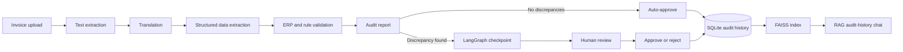

# AI Invoice Auditor

An agentic invoice-auditing system that extracts invoice data, checks it against ERP records and configurable business rules, pauses exceptions for human review, and makes completed audits searchable through RAG.

## What it does

- Accepts PDF, DOCX, and PNG invoices
- Extracts text with `pdfplumber`, `python-docx`, or Tesseract OCR
- Translates invoice text to English and records a translation confidence score
- Uses an LLM to turn unstructured invoice text into structured header and line-item data
- Checks required fields, vendor identity, currency, quantities, and unit prices
- Routes clean invoices to approval and discrepancies to a human review queue
- Persists workflow checkpoints and audit decisions in SQLite
- Indexes audit history in FAISS and answers natural-language questions with source invoice IDs
- Exposes the workflow through a FastAPI API and a Next.js review dashboard

## System flow



## Why the workflow is stateful

The pipeline is built as a LangGraph state machine rather than a single LLM call. Each stage writes to shared invoice state, and SQLite checkpointing preserves the state when the graph reaches an exception. A reviewer can edit the extracted data, add a decision note, approve or reject the invoice, and resume the same workflow thread.

```text
extractor -> translator -> validator -> business_validator -> reporter
                                                               |
                                            clean -------------+----> end
                                                               |
                                            exception -> human review -> end
```

## Validation logic

The validation layer combines deterministic checks with LLM-assisted extraction and vendor matching.

Current rules include:

- Required invoice headers: invoice number, date, vendor, currency, and total
- Vendor lookup against mock ERP vendor records
- Currency validation against the vendor's ERP currency
- Purchase-order line-item matching by SKU
- Exact quantity matching
- Unit-price tolerance configured in `config/rules.yaml` (5% by default)

The repository includes mock vendor and purchase-order data so the full decision path can be exercised locally.

## Human-in-the-loop review

Invoices with discrepancies are interrupted before the `human_review` node. The dashboard lets a reviewer:

1. Open a paused invoice
2. Inspect system discrepancies
3. Correct the structured invoice JSON
4. Add an audit note
5. Approve or reject the invoice

The final decision and note are saved to the audit history and included in the searchable knowledge base.

## RAG over audit history

Completed audit records are converted into documents containing the invoice, vendor, line items, decision, reviewer comment, and system flags. They are embedded with `sentence-transformers/all-MiniLM-L6-v2` through the Hugging Face endpoint and stored in a local FAISS index.

The query service retrieves the four most similar audit records and sends only that context to the generation model. Responses include the source invoice IDs returned by retrieval.

## Tech stack

**Backend and orchestration**

- Python, FastAPI, Uvicorn
- LangGraph with SQLite checkpointing
- LiteLLM with Groq-hosted models
- SQLite

**Document processing**

- `pdfplumber`
- `python-docx`
- Tesseract OCR and Pillow

**Retrieval**

- FAISS
- Hugging Face endpoint embeddings
- LangChain

**Frontend**

- Next.js, React, TypeScript
- Tailwind CSS
- Axios

## Repository structure

```text
.
├── agents/
│   ├── extractor_agent.py
│   ├── translator_agent.py
│   ├── validation_agent.py
│   ├── business_validation_agent.py
│   ├── reporting_agent.py
│   └── rag_agents/
├── config/rules.yaml
├── data/ERP_mock_data/
├── frontend/
├── langgraph_workflow/workflow.py
├── mock_erp/app.py
└── Dockerfile
```

## Run locally

### Prerequisites

- Python 3.11+
- Node.js and npm
- Tesseract OCR if you want to process PNG invoices
- A Groq API key
- A Hugging Face token for audit-history embeddings

### 1. Clone the repository

```bash
git clone https://github.com/vaibhavsaran03/AI-Invoice-Auditor.git
cd AI-Invoice-Auditor
```

### 2. Configure environment variables

Create a `.env` file in the repository root:

```env
GROQ_API_KEY=your_groq_api_key
HUGGINGFACEHUB_API_TOKEN=your_huggingface_token
```

### 3. Start the backend

```bash
python -m venv .venv
source .venv/bin/activate
pip install -r requirements.txt
uvicorn mock_erp.app:app --reload --port 8000
```

On Windows PowerShell, activate the environment with:

```powershell
.venv\Scripts\Activate.ps1
```

The API runs at `http://127.0.0.1:8000`. Interactive API docs are available at `http://127.0.0.1:8000/docs`.

### 4. Start the frontend

In another terminal:

```bash
cd frontend
npm install
```

Create `frontend/.env.local`:

```env
NEXT_PUBLIC_API_URL=http://127.0.0.1:8000
```

Then run:

```bash
npm run dev
```

Open `http://localhost:3000`.

### Docker

The included Dockerfile runs the FastAPI backend and installs Tesseract:

```bash
docker build -t ai-invoice-auditor .
docker run --env-file .env -p 10000:10000 ai-invoice-auditor
```

The Next.js frontend runs separately.

## API overview

| Method | Endpoint | Purpose |
|---|---|---|
| `POST` | `/api/upload` | Upload an invoice |
| `POST` | `/api/process/{filename}` | Run the audit workflow |
| `GET` | `/api/hitl-queue` | List paused workflow threads |
| `GET` | `/api/hitl-details/{thread_id}` | Read extracted data and discrepancies |
| `POST` | `/api/hitl-action/{thread_id}` | Save reviewer edits and approve or reject |
| `POST` | `/api/chat` | Query indexed audit history |
| `GET` | `/api/audit-stats` | Return the approved-invoice count |
| `GET` | `/api/rejected-history` | Return rejected audit records |

## Current scope

This is a working prototype built around mock ERP files and local persistence. Before production use, the API would need authentication and authorization, restricted CORS, durable managed storage, background job processing, stronger schema validation, secret management, and automated tests.
